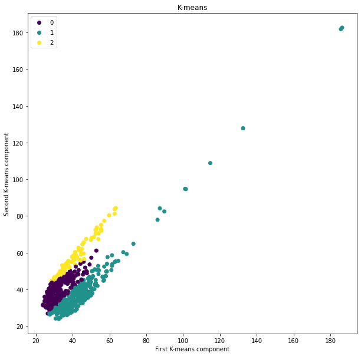
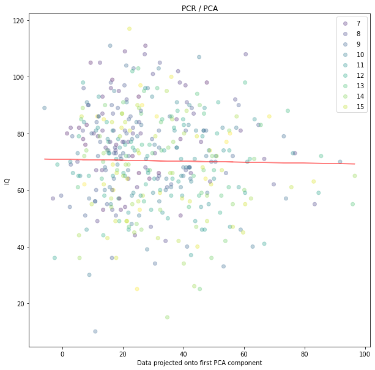
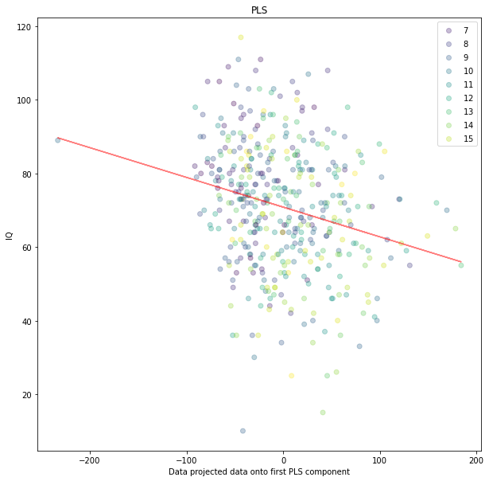

# Processing

## Experiments

### Generate Functional Connectivity

After preprocessing all of the fMRI data, I had to convert the data into a compressed representation for the machine learning models to handle. Example representations include functional connectivity (FC) and intersubject correlation (ISC). To generate the FCs of subjects, I used Nilearn and the Python scripts are located here:

- [Testing](../src/FC/Testing%20FC.ipynb)
- [Generating](../src/FC/Generate%20FC.ipynb)

### Unsupervised

After the FCs are generated, I didn't have access to the labels (cognitive measures) so I tried some unsupervised models. This included testing PCA, ICA, K-means, and t-SNE and then back-projecting the transformed data back into an FC. This was somewhat successful and the results are shown below. The Python scripts:

- [Data Exploration](../src/Unsupervised/Data%20Exploration.ipynb)

### Data Sanity Check

While matching subjects to labels, I performed some quick sanity checks to ensure the data was ok. The results are displayed below.

### Supervised

Once I had the labels, I performed a matching between subjects and labels to get the subjects with labels (not all subjects had labels, and vice versa). After this, I used various supervised models to tease out any link between FC and cognitive score (IQ). I didn't find any promising results as shown below. The Python scripts:

## TODO

- Explore FC changes over ages
- Explore FC correlation with cognitive measures
- Explore FC into CNN to predict cognitive measures
- Explore ISC
- Explore compression algorithm on FC
- Explore models lsvc, dnn, ica

- Multivariate regression (once I can predict IQ well, predicting multiple labels)
- For PCA, separate ages
  - Kinda done
- Run PCA for different components until explained variance is high
  - With 50 PCA components, I get an explained variance = 0.61 and an r^2 = 0.11.
- Try getting rid of outlier
- Try combining cognitive measures to amplify effect of executive function
  - FSIQ already combines it
  - WIAS for ages above 16 so not considering it
- Try different components of ICA, Use ica on the saveresids files, not the FC (Have to cross validate to not make it circular)
- Another dimensionality reduction is to take the 15 strongest connections
- Superimpose Yeo template and then only take the connections within the fronto-parietal network , DMN, FP <-> DMN
- Look for demographic variables
- Add Kathleen dataset
- Keep the feature space but feature selection (don't reduce/compress).
  - Filter methods, feature selection, rank the features
  - Mutual information
- Too many noisy variables, remove them but also keep the informative ones
- Use brain volume
- It's unclear what's involved in the executive network.
- Huge divide between labels and brain functions. What are the mechanisms that differentiate these abilities?
- Take the individual scores and combine them in a way we believe is meaningful
- Instead of IQ, if we used a subtest, would we get different results?

assessment Basic_Demos,Age

Meeting Agenda

- Next advisory committee meeting
- Applying to another scholarship
- Bobby new position
- Reminder of seminar presentation date
